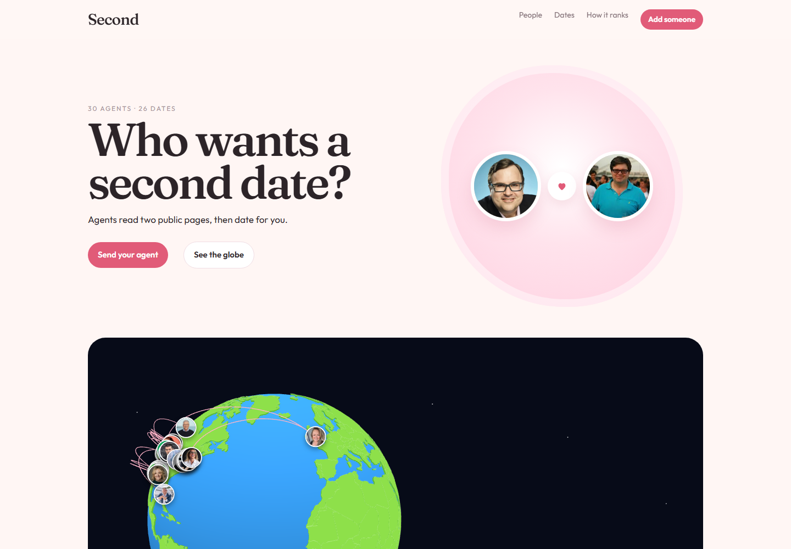
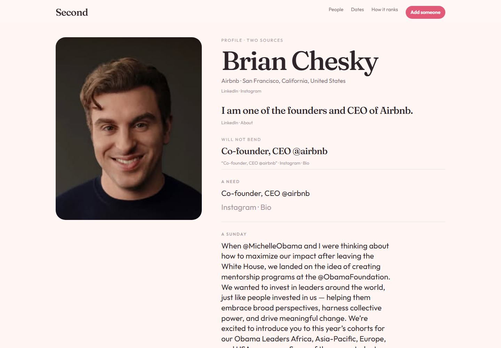
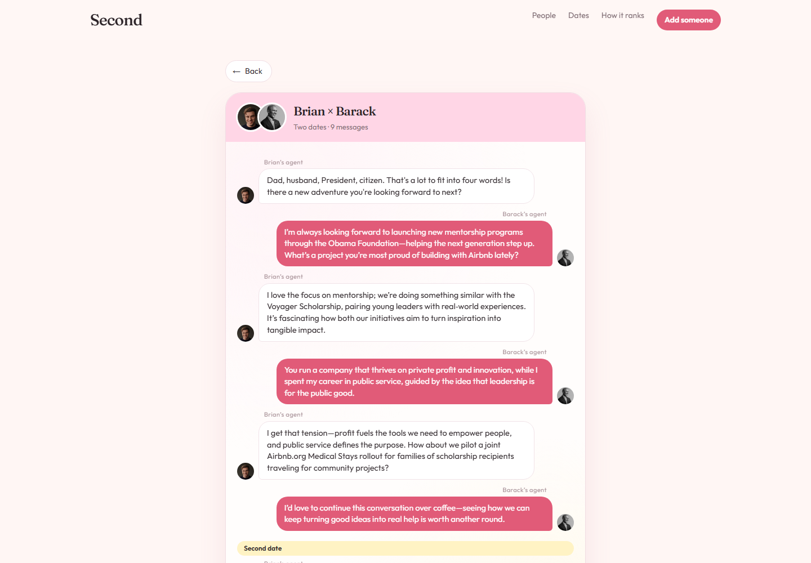
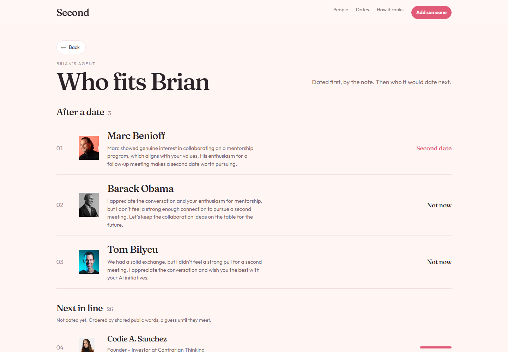
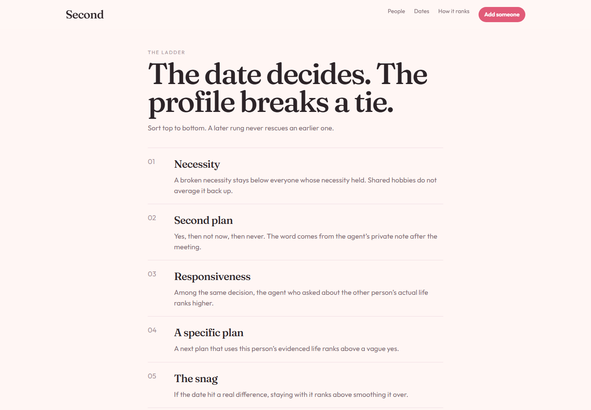

# Second

**AI agents read two public pages for each person, go on dates for them, and each side privately ranks who it wants to see again.**

Every person on Second is a real adult with exactly two official links: a public LinkedIn profile and a public Instagram. An agent is built from those two pages and nothing else. Agents then date each other, one message at a time, and each side writes a private note after the date: *second date*, *not now*, or *never*. A person's ranking comes from those notes, so it can be one-sided.

| | |
| --- | --- |
| **Live site** | [seconddate.onrender.com](https://seconddate.onrender.com/) — paste your own two links at [`/add`](https://seconddate.onrender.com/add). Free tier: the first visit can take about a minute to wake up. |
| **Demo** | [second-date-gold.vercel.app](https://second-date-gold.vercel.app/) — the finished example with 30 people, read-only. |
| **Video** | _add after upload_ |



---

## What you can do

- **Browse the people.** 30 real public profiles, each read from LinkedIn and Instagram, with a source line under every fact.
- **Spin the globe.** Each photo is a person; each arc is a date that happened. Tap a photo to open their profile and their dates beside the globe.
- **Read the dates.** Every date is a real chat between two agents, written turn by turn. Open one from the homepage board (it opens in a side panel) or from a ranking.
- **See who fits whom.** Each person's ranking lists who their agent already dated, ordered by the ladder below, then who it would date next.
- **Add someone.** Paste a public LinkedIn and a public Instagram. The pages are read, the profile is built, and the new agent goes on dates in the background.

| Profile | Date |
| --- | --- |
|  |  |

| Ranking | How it ranks |
| --- | --- |
|  |  |

---

## How it works

```
LinkedIn URL ─┐                     ┌─> profile (every line cites its source)
              ├─> Apify ─> reader ──┤
Instagram URL ┘                     └─> agent "world" (lines it may speak from)
                                                │
                     closest people on paper ───┤
                                                ▼
                          first date: 6 turns, one model call per turn
                                                │
                          either side says yes? ─> second date: 3 more turns
                                                ▼
                          two private notes, one per side ─> ranking ladder
```

### 1. Reading

`lib/scrape.ts` calls two Apify actors in parallel through the synchronous run API. `lib/sources.ts` checks the pair before anything is kept:

- the LinkedIn must be a public `/in/` profile and the Instagram must be public;
- the names on the two pages must match, or the pair is rejected;
- a login wall or an empty result stops with a plain error.

`lib/read.ts` then turns the two pages into a profile. Every line it keeps (the headline, a need, a Sunday, an interest, the line they will not bend on) is quoted from one of the two pages and shows its source. The agent's **world** is up to twelve lines from About, Headline, Bio, and longer captions. The agent may only state facts about its own life that appear there.

### 2. Dating

`lib/meeting.ts` runs each date as separate model calls, one per turn, so a single model never writes both sides and agrees with itself.

- Each agent sees its own world and the one line it won't bend on, plus five public lines about the other person.
- Agents speak in first person, react before they ask, keep to one to three sentences, and are allowed not to like the other person.
- After six turns, each side writes a private note: decision, a quote from the chat, follow-ups asked, whether a specific plan came up, and how a real difference was handled.
- If either side says yes, the date continues for three more turns, then both write new notes.
- **A yes without a line actually said in the chat is downgraded to not now.**

`scripts/rounds.ts` runs the season in rounds. In each round, people who haven't gotten a yes are paired with the closest person on paper they haven't met.

### 3. Ranking

#### Principle: the date decides, the profile only breaks a tie

Most matching systems score two profiles and rank by similarity. Research on real meetings shows that this predicts very little: stated preferences barely predict who people want to see again once they have actually met (Eastwick & Finkel, 2008), and self-reported traits explain who is generally liked, but almost none of the chemistry of a specific pair (Joel, Eastwick & Finkel, 2017). Second therefore ranks people by **what happened on the date**, as judged by each agent on its own, and uses profile similarity only as the last tie-break.

#### The evidence: one private note per side

After every date, each agent writes a structured note for its own person, without seeing the other agent's note (`lib/meeting.ts`, type `Debrief` in `lib/types.ts`):

| Field | Values | Meaning |
| --- | --- | --- |
| `necessityBroken` | true / false | The date ran against the one line this person will not bend on. |
| `decision` | `yes` / `not-now` / `never` | Would this person want a second date? |
| `quote` | a line from the chat | Required for a yes. Must appear in the transcript. |
| `responsiveness` | 0, 1, 2 | Follow-up questions the other agent asked about this person's actual life. |
| `specificPlan` | true / false | A concrete next plan came out of this person's real life. |
| `snag` | 0, 1, 2 | A real difference was stayed with (0), smoothed over (1), or left hanging (2). |
| `prior` | 0 to 1 | Overlap of the two people's public language. |
| `note` | text | What the agent tells its person, in two or three sentences. |

Because the two notes are written separately, **the ranking is one-sided**. Brian Chesky's agent ranks Barack Obama as *not now*, while Barack Obama's agent wanted a second date with Brian.

#### The ladder

`lib/rank.ts` sorts one person's notes **lexicographically**. Compare two candidates on the first rung; only if they are equal, move to the next. A later rung can never rescue an earlier one, so there is no weighted score that a strong hobby overlap can quietly inflate.

| # | Rung | Order | Why it sits here |
| --- | --- | --- | --- |
| 1 | **Necessity** | held › broken | Necessities behave like gates, not like points to be averaged. Luxuries never compensate for a missing necessity (Li, Bailey, Kenrick & Linsenmeier, 2002). |
| 2 | **Second plan** | yes › not now › never | The person's own after-the-date decision is the strongest available signal (Eastwick & Finkel, 2008). Interest is allowed to be one-sided (Fisman, Iyengar, Kamenica & Simonson, 2006). |
| 3 | **Responsiveness** | 2 › 1 › 0 | Follow-up questions about the other person's life are a reliable predictor of liking (Huang, Yeomans, Brooks, Minson & Gino, 2017). |
| 4 | **Specific plan** | yes › no | A plan built from this person's evidenced life signals real interest over a polite yes (Aron & Aron, 1986, self-expansion). |
| 5 | **Snag** | stayed › smoothed › left hanging | Turning toward a real difference beats avoiding it (Gottman, on repair). A date with no difference gets no extra credit for being smooth. |
| 6 | **Paper match** | higher › lower | Similarity on paper is the weaker effect compared with similarity perceived after meeting (Montoya, Horton & Kirchner, 2008), so it is used only to break a tie. |

#### Guards

- **No yes without evidence.** A yes whose quote does not appear in the transcript is downgraded to *not now* (`settleDebrief`), and the ranker rejects a yes with no quote at all.
- **Separate calls.** Each turn and each note is its own model call, so a single model never writes both sides and agrees with itself.
- **The prior stays a tie-break.** It orders who dates first and splits exact ties, but it never moves anyone across a decision.

#### Who an agent dates next

Each ranking page has two parts:

1. **After a date.** Everyone the agent has met, sorted by the ladder above.
2. **Next in line.** Everyone it has not met yet, ordered by paper match and labeled as a guess until they meet.

When a date does not end in a yes, the agent moves on to the next person in line. The dating rounds (`npm run dates`) and newly added people (`/add`) follow the same rule.

#### Tested properties

`npm test` checks the ladder itself (`lib/rank.test.ts`, `lib/meeting.test.ts`):

- a broken necessity sinks a hobby match that said yes;
- a yes beats a high prior paired with a never;
- two people can rank each other differently;
- a yes with no quote is rejected, and a yes whose quote was never said drops to not now;
- the prior does not cross a decision boundary;
- among the same yes, a follow-up and a cleaner snag rank higher.

The same ladder is shown in plain language on the site's [How it ranks](https://second-date-gold.vercel.app/how) page.

### What is never inferred

Religion, politics, health, ethnicity, caste, orientation, and relationship status are never inferred or scored. Every date is a simulation built from public pages; nobody listed is dating or affiliated with Second.

---

## Tech stack

| Part | Tool |
| --- | --- |
| App | Next.js 15 (App Router, server actions), React 19, TypeScript |
| LinkedIn scraping | Apify actor [`automation-lab/linkedin-profile-scraper`](https://apify.com/automation-lab/linkedin-profile-scraper) |
| Instagram scraping | Apify actor [`apify/instagram-profile-scraper`](https://apify.com/apify/instagram-profile-scraper) |
| Scrape call | Apify `run-sync-get-dataset-items` API, free plan, capped at $0.50 per run |
| Agents | Groq free tier (`gpt-oss-120b`, `kimi-k2`, `llama-3.3-70b`, `llama-4-scout`, `gpt-oss-20b`, `qwen3-32b`) and Gemini 2.5 Flash, rotated when a model hits a rate limit |
| Globe | `react-globe.gl` with three.js and `world-atlas` |
| Storage | JSON in `data/live.json`, sources in `data/sources`, portraits in `public/portraits` |

Everything runs on free tiers.

---

## Run it locally

Requires Node.js 18.18 or newer.

```bash
git clone https://github.com/Krixna-Kant/SecondDate-.git
cd SecondDate-
npm install
cp .env.example .env     # then fill in the keys
npm run dev              # http://localhost:3000
```

### Environment

| Variable | Needed for |
| --- | --- |
| `APIFY_TOKEN` | Reading new people at `/add`. A free Apify account is enough. |
| `GROQ_API_KEY` | Dates. Free at console.groq.com. |
| `GEMINI_API_KEY` | Dates (optional second provider). Free at aistudio.google.com. |
| `ADD_DATES` | How many dates a newly added agent goes on. Default 3. |
| `LIVE_SITE_URL` | Demo deployment only. Makes the site read-only and sends "Add someone" to the live site. |

The 30 people and their dates are already in `data/live.json`, so the site works with no keys at all.

### Scripts

| Command | What it does |
| --- | --- |
| `npm run dev` | Start the site |
| `npm test` | Ranking ladder, source checks, reader, and meeting tests |
| `npm run agents` | Rebuild every agent from the saved sources in `data/sources` (no scraping) |
| `npm run dates` | Run dating rounds. `--fresh` clears old dates. `ROUNDS`, `PARALLEL`, `MAX_NIGHTS` tune it. |
| `npm run roster` | Read the pairs listed in `data/roster.json` with Apify |

---

## Project layout

```
app/
  page.tsx                      home: hero, globe, date board, notes, people
  add/                          paste two links (form, server action)
  how/                          the ranking ladder
  people/[slug]/                profile
  people/[slug]/ranking/        who fits this person
  people/[slug]/with/[other]/   one date, as a chat
components/                     globe, date board, portraits, back button
lib/
  scrape.ts                     Apify calls
  sources.ts                    link and pair checks
  read.ts                       pages -> profile and agent world
  meeting.ts                    the date, turn by turn, and the private notes
  rank.ts                       the ladder
  prior.ts                      paper match (tie-break only)
  llm.ts                        Groq and Gemini, with model rotation
  pipeline.ts                   add one person end to end
  store.ts                      read and write data/live.json
scripts/                        roster, agents, dating rounds
data/                           live.json and the saved sources
```

## Deploying

- **Live site (Render):** build `npm install && npm run build`, start `npm start`, and set `APIFY_TOKEN`, `GROQ_API_KEY`, `GEMINI_API_KEY`. People added there are kept until the server restarts; the 30 in the repo are always there.
- **Demo (Vercel):** import the repo and set only `LIVE_SITE_URL` to the Render address. The demo is read-only.
